## 数据库

###  数据库基础知识

数据库：存储数据的仓库

内存存储

​	数据无法持久化

​	无法保存大量的数据

文件存储

​	速度太慢，无法忍受

​	很难确定数据的结构以及关系，增加、删除、修改麻烦，需要你自己按照一种固定的方式

​	不安全，随便一个人都能打开你的文件

###数据库概述

- **数据结构化**

 

 

 

 

- **实现数据共享**

 

不是为某一个用户存储特定的数据

- 可以减少冗余数据

- 数据独立性高

- 数据统一管理与控制 

### 数据结构化

数据库就是用来存储数据的。

电子化的文件柜——存储电子文件的处所

一个容器。

就是用来存储电子化的数据的

数据库管理系统（DataBase Management System，DBMS）：

为管理[数据库](https://zh.wikipedia.org/wiki/%E6%95%B0%E6%8D%AE%E5%BA%93)而设计的大型电脑[软件](https://zh.wikipedia.org/wiki/%E8%BD%AF%E4%BB%B6)管理系统

[Oracle](https://zh.wikipedia.org/wiki/Oracle)、[Microsoft SQL Server](https://zh.wikipedia.org/wiki/Microsoft_SQL_Server)、[Access](https://zh.wikipedia.org/wiki/Access)、[MySQL](https://zh.wikipedia.org/wiki/MySQL)及[PostgreSQL](https://zh.wikipedia.org/wiki/PostgreSQL)

数据库应用程序（DataBase Application）：

其实就是一些图形化管理界面的GUI软件，来操作数据库管理系统管理我们的数据

### 数据库存储结构

 

一个数据库服务器可以管理多个数据库，通常情况下开发人员会针对每个应用创建一个数据库，为保存应用中实体的数据，会在数据库中创建多个表（用于存储和描述数据的逻辑结构），每个表都记录着实体的相关信息。

一个数据库服务器中可以有多个数据库

一个数据库当中可以有多张表用来存储数据

一个表中可以用来存储多条记录

### SQL 语言


SQL（Structure Query Language）：结构化查询语言

是一种数据库**查询语言**。

SQL语言是一个标准。由一个规范组织提出和维护的。

市面上常见的数据库基本都支持SQL查询语言。

#### DDL

l 数据定义语言（Data Definition  [ˌdefɪˈnɪʃn]  Language）简称**DDL**

数据库定义语言主要用于定义数据库、表等，其中包括：

CREATE  语句用于创建数据库、数据表等

ALTER   语句用于修改表的定义等

DROP    语句用于删除数据库、删除表等

### DML

l 数据操作语言（Data Manipulation [məˌnɪpjʊ'leɪʃn] Language）简称DML

数据操作语言主要用于对数据进行添加、修改和删除操作，其中包括：

INSERT 语句用于插入数据

UPDATE 语句用于修改数据

DELETE 语句用于删除数据

####DQL

l 数据查询语言（Data Query Language）简称DQL

数据查询语言主要用于查询数据，也就是SELECT语句，使用SELECT 语句可以查询数据库中一条数据或多条数据

数据库中的操作都是通过SQL语句来完成的，而且在应用程序中也经常使用SQL语句，例如在Node.js中嵌入SQL语句，通过执行JavaScript语言来调用SQL语句，就可以完成数据的插入、修改、删除、查询等操作。

SQL语句还可以嵌入到其它语言中，如Java、PHP等。

### 常见的数据库产品

####Orcale数据库

Orcale数据库管理系统由**甲骨文公司**开发，在数据库领域一直处于领先地位。

大型的商业型数据库，目前国内一些大公司在用，国企

淘宝、京东等都有使用，一个很老牌的数据库，稳定

####SqlServer数据库

由微软公司开发，只能在Windows上运行。.net程序员。

但是，微软现在已经把SqlServer移植到了别的平台，例如：Linux

#### DB2数据库

由IBM公司开发，在**金融行业**中使用的比较多。IBM的服务器，买服务器送数据库。

IBM靠硬件发家的，小型机。小型服务器

比较稳定

####MySQL数据库

MySQL数据管理系统由瑞典的MySQLDB公司开发，但是几经辗转，现在已经是Oracle的产品了。

开源、免费、轻量

MySQL具有跨平台的特性，不仅可以在Windows平台上使用，还可以在Unix、Linux和Mac OSX平台上使用。

相对其它数据库而言，MySQL的使用也更加方便、快捷而且MySQL免费所以**运营成本低**，因此很多公司都在用MySQL。

Oracle收购过来之后，发行了两个版本：

​	一个是企业版，公司买了之后，Oracle公司可以提供一些服务，例如数据恢复，或者说存储数据出现了问题

​	一个社区版，也就是免费开原版

#### MongoDB数据库

mongodb是一种非关系型数据库，简称NoSQL

存储方式，不是数据库-表-记录了

mongod的存储方式是：数据库-集合-实体（随便存储，就像json对象一样）

MongoDB是由10gen公司开发的一个介于关系型数据库和非关系型数据库之间的产品，是非关系型数据库中功能最丰富，最像关系型数据库的。他支持的数据结构非常松散，是类似json的格式，所以可以存储比较复杂的数据结构类型。

MongoDB数据库管理系统最大的特点就是它支持的查询语言非常强大，语法类似于面向对象的查询语言。它还是一个开源的数据库，对于大数据量、高并发的互联网应用，支持非常不错。

操作非关系型数据库不需要使用SQL语言


##  MySQL安装与配置

###  Windows平台下安装和配置MySQL

官方网站：<http://www.mysql.com/>

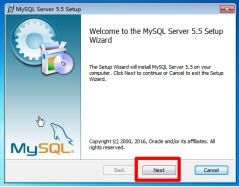 

 

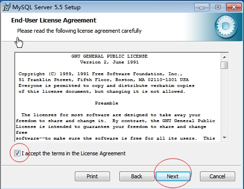 

 

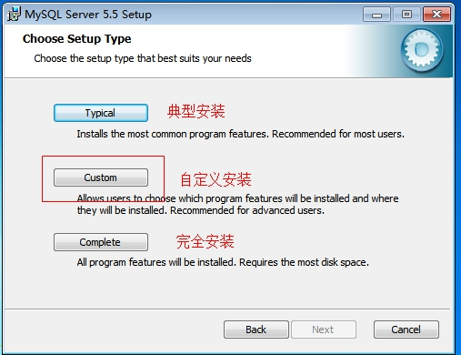 

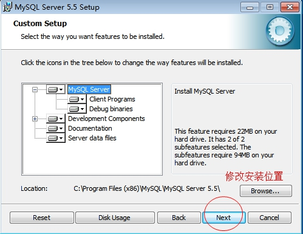 


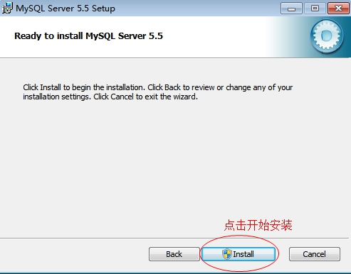 

 

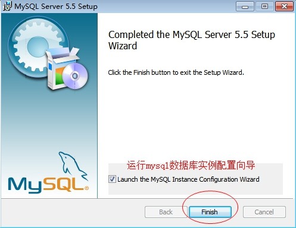 

 

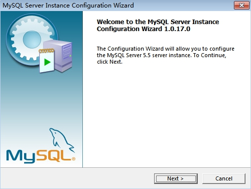 

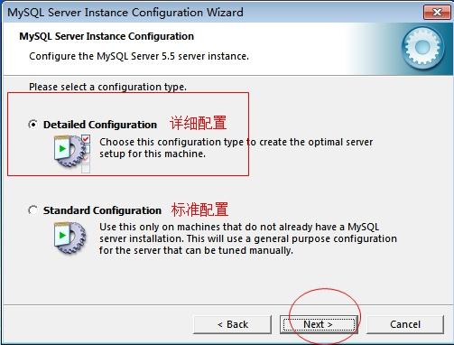 

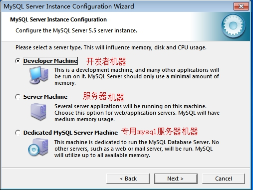 

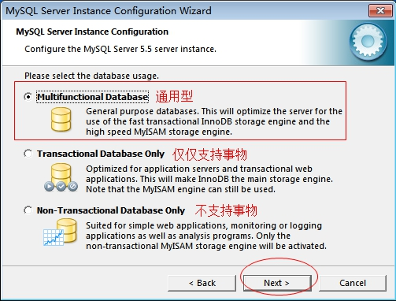 

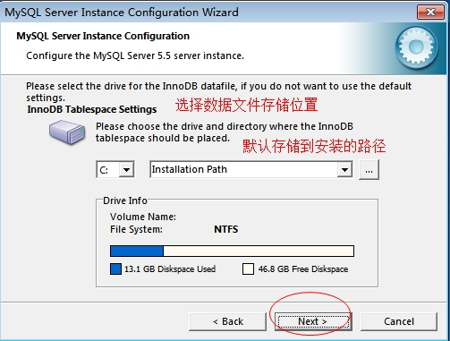 

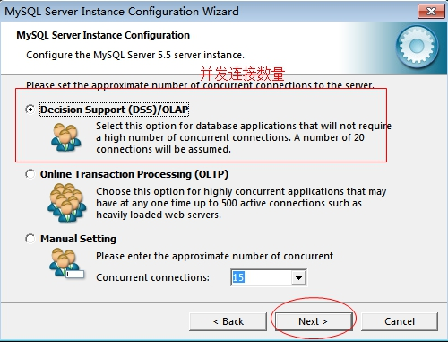 

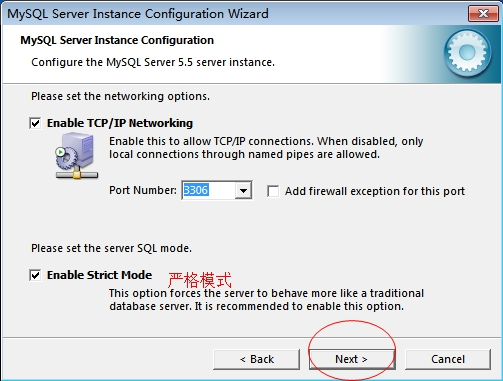 

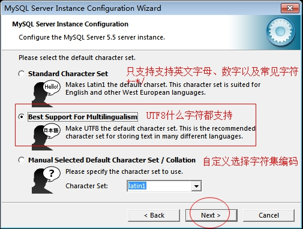 

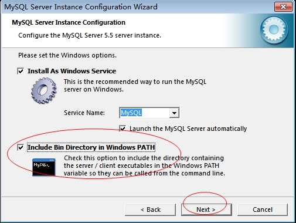 

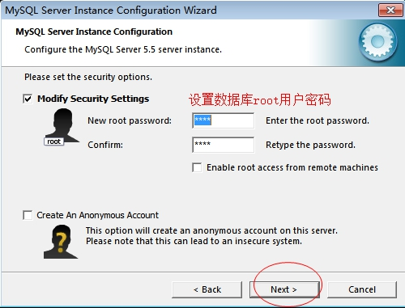 

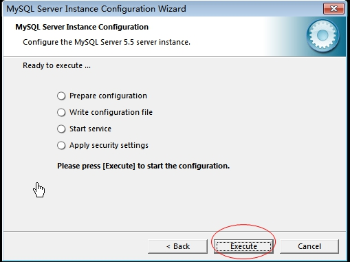 

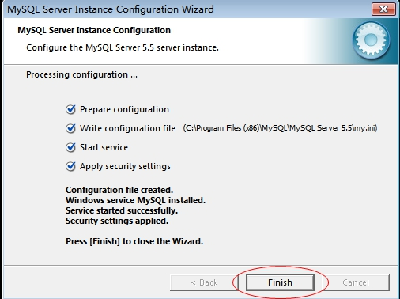 

 

验证mysql是否安装成功：

- 打开命令台，输入services.msc找到mysql服务

- 通过在cmd命令台中输入path查看是否有mysql的bin目录

###  MySQL目录结构

bin：可执行文件所在目录

data：数据文件所在目录

Docs：文档目录

share：存放字符集等信息

my.ini：MySQL数据库使用的配置文件

## 1.1 MySQL的使用

### 1.1.1 启动 和 停止MySQL服务

1. 通过Windows服务管理器启动MySQL服务

通过Windows的运行，输入services.msc找到MySQL服务

1. 通过DOS命令启动MySQL服务

   et stop mysql	停止MySQL服务

   et start mysql	开启MySQL服务

### 登录MySQL数据库

**使用相关命令登录**

打开命令台：

mysql -h localhost -P 3306 -u root -p

-h：主机名

-P：端口

-u：用户名

-p：密码

这种方式一般用来连接远程数据库服务器

mysql默认连接localhost和3306，所以可以省略-h和-P

mysql -u root -p

这种方式一般用来连接本机，可以省略-h和-P，默认就是localhost和3306

#### 创建数据库

**CREATE** DATABASE [IF **NOT EXISTS**] db_name;

创建   数据库	数据库名;

注意：一定要在语句的末尾加分号

注意：中括号都表示可选的意思，不是让你把中括号也写进入，否则mysql根本不识别。

#### 查看数据库

show database;

#### 删除数据库

**DROP** DATABASE [IF **EXISTS**] db_name;

#### 选择数据库

USE db_name;

### 数据库表的概念

​       我们的数据是面向表存储的，数据库表格式用来存储数据的，这个我们现实当中的表一样，我们首先需要定义表当中有多少列，然后我们可以往表当中添加一条一条的记录。我们在定义一张表的列时，我们需要先根据需求对这张表进行设计，设计一般主要是设计表当中有哪些列，这一列对应的名称是什么，它所存放的数据类型是什么，这个我们也称为表结构的设计。所以在学习表的设计之前，我们需要学习表的一些相关知识.

#####数据类型

数据类型是用来约束表当中每一列存放的数据类型。这样做的目的是为了

##### 整数类型

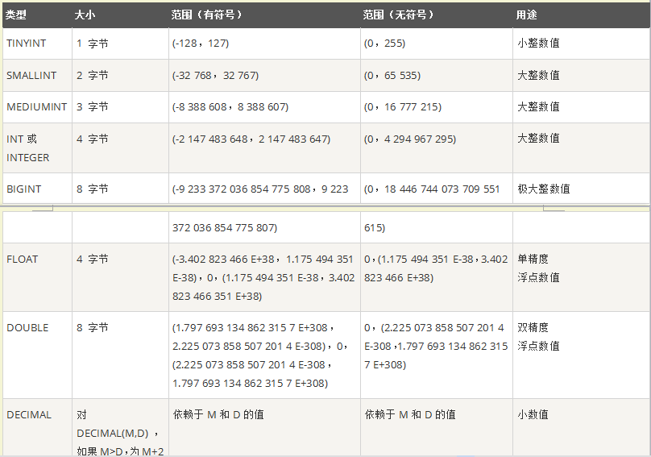

##### 日期和时间

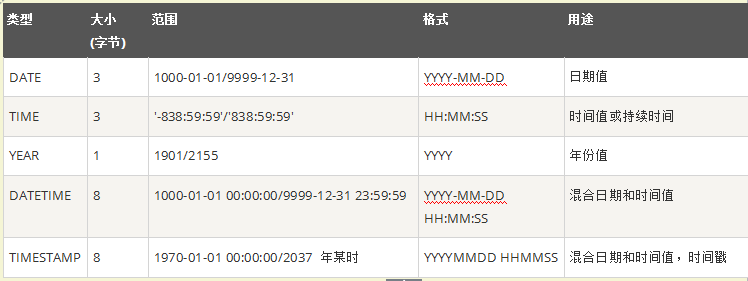

##### 字符串和二进制

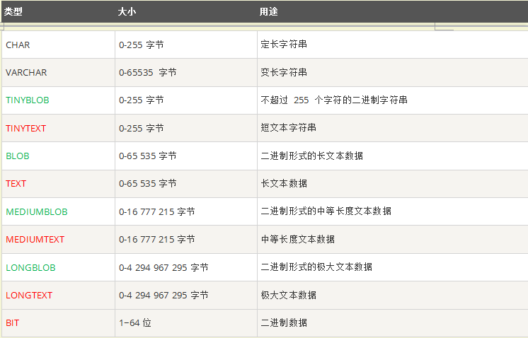


### 数据库表的基本操作

#### 创建数据库表

```
CREATE TABLE table_name
(
    field1  datatype,
    field2  datatype,
    field3  datatype,
)
```

#### 查看数据表

查看当前数据库中的所有表。

```
show tables;
```

查看表结构

``` 
desc table_name;
```

查看建表语句

```
show create table table_name;
```

####删除数据表

```
DROP TABLE table_name;
```

### 表的约束

为了防止数据表中插入错误的数据，在MySQL中，定义了一些维护数据库完整性的规则，即表的约束。

| 约束条件    | 说明                             |
| ----------- | -------------------------------- |
| PRIMARY KEY | 主键约束，用于唯一标识对应的记录 |
| FOREIGN KEY | 外键约束                         |
| NOT NULL    | 非空约束                         |
| UNIQUE      | 唯一性约束                       |
| DEFAULT     | 默认值约束，用于设置字段的默认值 |

表的约束条件都是针对表中字段进行限制，从而保证数据表中数据的正确性和唯一性。

### 数据处理

#### 增加数据

```
INSERT INTO table_name VALUES(value1,value2,value3...);
```

#### 修改数据

```
UPDATE table_name     SET col_name1=expr1 , col_name2=expr2  where condition;
```

#### 删除数据

```
delete from** table_name  [WHERE where_definition];
```

#### 查询数据

```
SELECT [DISTINCT] *|{colum1, colum2, colum3...} FROM table_name;
SELECT指定查询哪些列的数据
column指定列名
* 号表示查询所有列
FROM 指定查询哪种表
DISTINCT 可选，指查询结果时，是否去除重复数据
```

### SQLYong 的介绍

它是一个基于图形化界面的mysql 客户端软件，通过此软件，我们可以通过图形化界面的方式去连接数据库，

创建表，增删改查数据。整个操作都是基于图形化界面的，避免我们编写大量的sql 语句，提升我们的开发效率。

