## 数据库

### 数据库基础知识

数据库：存储数据的仓库

内存存储

​ 数据无法持久化

​ 无法保存大量的数据

文件存储

​ 速度太慢，无法忍受

​ 很难确定数据的结构以及关系，增加、删除、修改麻烦，需要你自己按照一种固定的方式

​ 不安全，随便一个人都能打开你的文件

###数据库概述

- **数据结构化**


- **实现数据共享**


不是为某一个用户存储特定的数据

- 可以减少冗余数据

- 数据独立性高

- 数据统一管理与控制

### 数据结构化

数据库就是用来存储数据的。

电子化的文件柜——存储电子文件的处所

一个容器。

就是用来存储电子化的数据的

数据库管理系统（DataBase Management System，DBMS）：

为管理[数据库](https://zh.wikipedia.org/wiki/%E6%95%B0%E6%8D%AE%E5%BA%93)而设计的大型电脑[软件](https://zh.wikipedia.org/wiki/%E8%BD%AF%E4%BB%B6)管理系统

[Oracle](https://zh.wikipedia.org/wiki/Oracle)、[Microsoft SQL Server](https://zh.wikipedia.org/wiki/Microsoft_SQL_Server)、[Access](https://zh.wikipedia.org/wiki/Access)、[MySQL](https://zh.wikipedia.org/wiki/MySQL)及[PostgreSQL](https://zh.wikipedia.org/wiki/PostgreSQL)

数据库应用程序（DataBase Application）：

其实就是一些图形化管理界面的 GUI 软件，来操作数据库管理系统管理我们的数据

### 数据库存储结构


一个数据库服务器可以管理多个数据库，通常情况下开发人员会针对每个应用创建一个数据库，为保存应用中实体的数据，会在数据库中创建多个表（用于存储和描述数据的逻辑结构），每个表都记录着实体的相关信息。

一个数据库服务器中可以有多个数据库

一个数据库当中可以有多张表用来存储数据

一个表中可以用来存储多条记录

### SQL 语言

SQL（Structure Query Language）：结构化查询语言

是一种数据库**查询语言**。

SQL 语言是一个标准。由一个规范组织提出和维护的。

市面上常见的数据库基本都支持 SQL 查询语言。

#### DDL

l 数据定义语言（Data Definition [ˌdefɪˈnɪʃn] Language）简称**DDL**

数据库定义语言主要用于定义数据库、表等，其中包括：

CREATE 语句用于创建数据库、数据表等

ALTER 语句用于修改表的定义等

DROP 语句用于删除数据库、删除表等

### DML

l 数据操作语言（Data Manipulation [məˌnɪpjʊ'leɪʃn] Language）简称 DML

数据操作语言主要用于对数据进行添加、修改和删除操作，其中包括：

INSERT 语句用于插入数据

UPDATE 语句用于修改数据

DELETE 语句用于删除数据

####DQL

l 数据查询语言（Data Query Language）简称 DQL

数据查询语言主要用于查询数据，也就是 SELECT 语句，使用 SELECT 语句可以查询数据库中一条数据或多条数据

数据库中的操作都是通过 SQL 语句来完成的，而且在应用程序中也经常使用 SQL 语句，例如在 Node.js 中嵌入 SQL 语句，通过执行 JavaScript 语言来调用 SQL 语句，就可以完成数据的插入、修改、删除、查询等操作。

SQL 语句还可以嵌入到其它语言中，如 Java、PHP 等。

### 常见的数据库产品

####Orcale 数据库

Orcale 数据库管理系统由**甲骨文公司**开发，在数据库领域一直处于领先地位。

大型的商业型数据库，目前国内一些大公司在用，国企

淘宝、京东等都有使用，一个很老牌的数据库，稳定

####SqlServer 数据库

由微软公司开发，只能在 Windows 上运行。.net 程序员。

但是，微软现在已经把 SqlServer 移植到了别的平台，例如：Linux

#### DB2 数据库

由 IBM 公司开发，在**金融行业**中使用的比较多。IBM 的服务器，买服务器送数据库。

IBM 靠硬件发家的，小型机。小型服务器

比较稳定

####MySQL 数据库

MySQL 数据管理系统由瑞典的 MySQLDB 公司开发，但是几经辗转，现在已经是 Oracle 的产品了。

开源、免费、轻量

MySQL 具有跨平台的特性，不仅可以在 Windows 平台上使用，还可以在 Unix、Linux 和 Mac OSX 平台上使用。

相对其它数据库而言，MySQL 的使用也更加方便、快捷而且 MySQL 免费所以**运营成本低**，因此很多公司都在用 MySQL。

Oracle 收购过来之后，发行了两个版本：

​ 一个是企业版，公司买了之后，Oracle 公司可以提供一些服务，例如数据恢复，或者说存储数据出现了问题

​ 一个社区版，也就是免费开原版

#### MongoDB 数据库

mongodb 是一种非关系型数据库，简称 NoSQL

存储方式，不是数据库-表-记录了

mongod 的存储方式是：数据库-集合-实体（随便存储，就像 json 对象一样）

MongoDB 是由 10gen 公司开发的一个介于关系型数据库和非关系型数据库之间的产品，是非关系型数据库中功能最丰富，最像关系型数据库的。他支持的数据结构非常松散，是类似 json 的格式，所以可以存储比较复杂的数据结构类型。

MongoDB 数据库管理系统最大的特点就是它支持的查询语言非常强大，语法类似于面向对象的查询语言。它还是一个开源的数据库，对于大数据量、高并发的互联网应用，支持非常不错。

操作非关系型数据库不需要使用 SQL 语言

## MySQL 安装与配置

### Windows 平台下安装和配置 MySQL

官方网站：<http://www.mysql.com/>


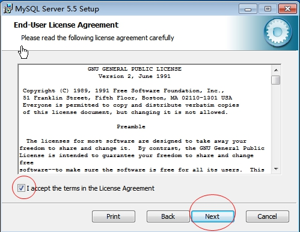

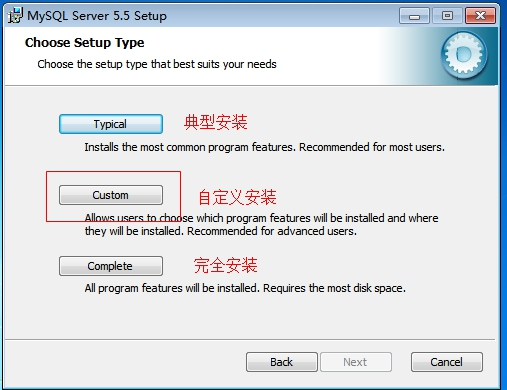

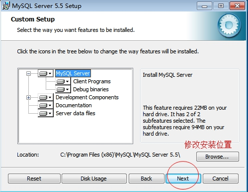

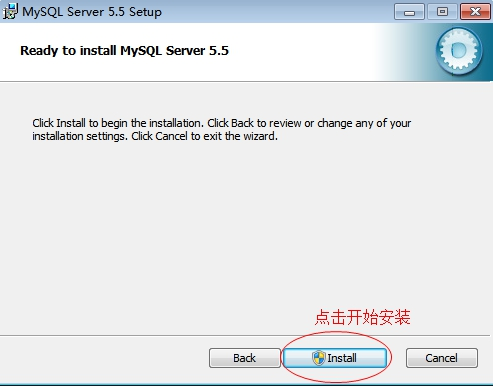

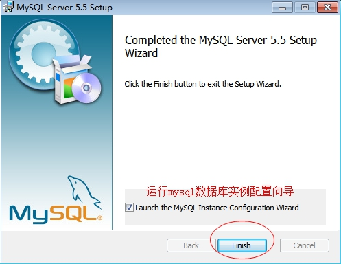

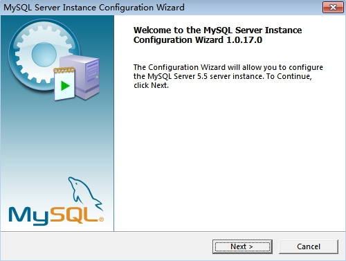

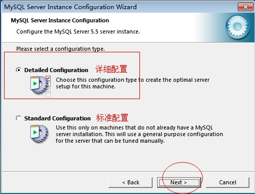

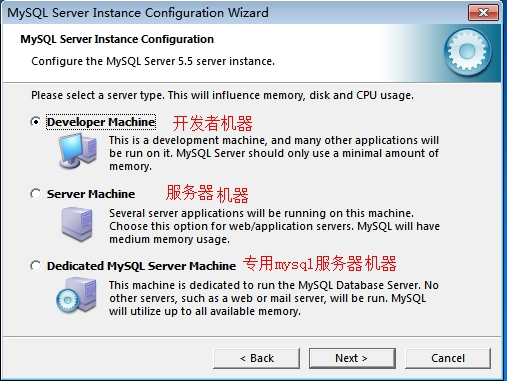

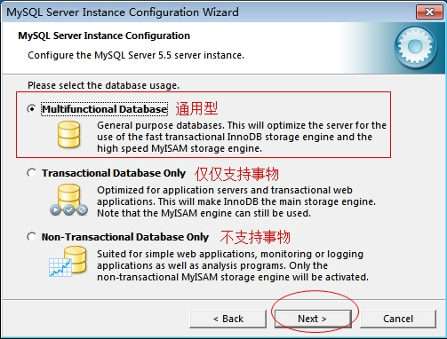

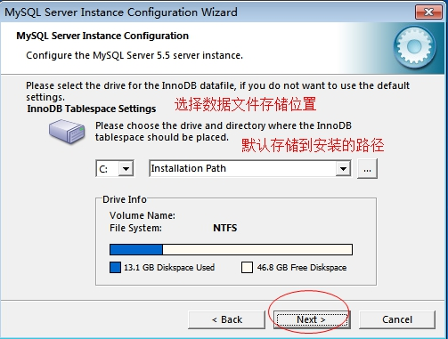


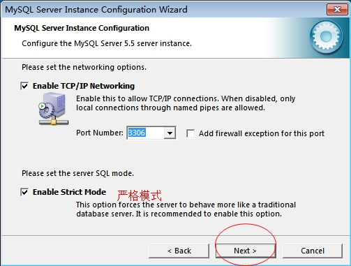


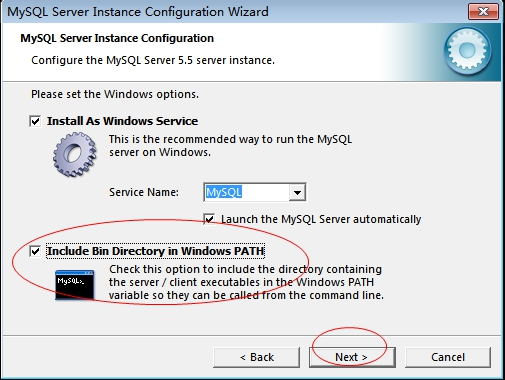

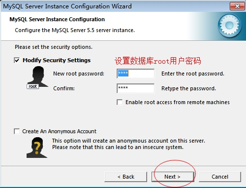

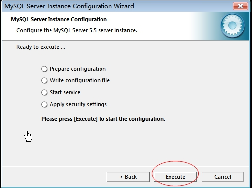

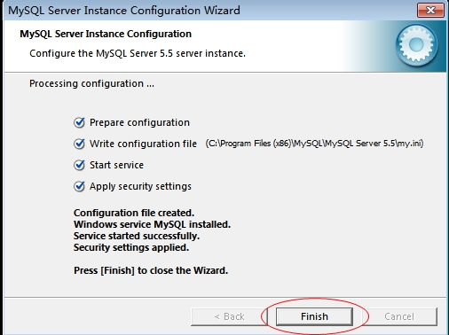

验证 mysql 是否安装成功：

- 打开命令台，输入 services.msc 找到 mysql 服务

- 通过在 cmd 命令台中输入 path 查看是否有 mysql 的 bin 目录

### MySQL 目录结构

bin：可执行文件所在目录

data：数据文件所在目录

Docs：文档目录

share：存放字符集等信息

my.ini：MySQL 数据库使用的配置文件

## 1.1 MySQL 的使用

### 1.1.1 启动 和 停止 MySQL 服务

1. 通过 Windows 服务管理器启动 MySQL 服务

通过 Windows 的运行，输入 services.msc 找到 MySQL 服务

1. 通过 DOS 命令启动 MySQL 服务

   et stop mysql 停止 MySQL 服务

   et start mysql 开启 MySQL 服务

### 登录 MySQL 数据库

**使用相关命令登录**

打开命令台：

mysql -h localhost -P 3306 -u root -p

-h：主机名

-P：端口

-u：用户名

-p：密码

这种方式一般用来连接远程数据库服务器

mysql 默认连接 localhost 和 3306，所以可以省略-h 和-P

mysql -u root -p

这种方式一般用来连接本机，可以省略-h 和-P，默认就是 localhost 和 3306

#### 创建数据库

**CREATE** DATABASE [IF **NOT EXISTS**] db_name;

创建 数据库 数据库名;

注意：一定要在语句的末尾加分号

注意：中括号都表示可选的意思，不是让你把中括号也写进入，否则 mysql 根本不识别。

#### 查看数据库

show database;

#### 删除数据库

**DROP** DATABASE [IF **EXISTS**] db_name;

#### 选择数据库

USE db_name;

### 数据库表的概念

​ 我们的数据是面向表存储的，数据库表格式用来存储数据的，这个我们现实当中的表一样，我们首先需要定义表当中有多少列，然后我们可以往表当中添加一条一条的记录。我们在定义一张表的列时，我们需要先根据需求对这张表进行设计，设计一般主要是设计表当中有哪些列，这一列对应的名称是什么，它所存放的数据类型是什么，这个我们也称为表结构的设计。所以在学习表的设计之前，我们需要学习表的一些相关知识.

#####数据类型

数据类型是用来约束表当中每一列存放的数据类型。这样做的目的是为了

##### 整数类型

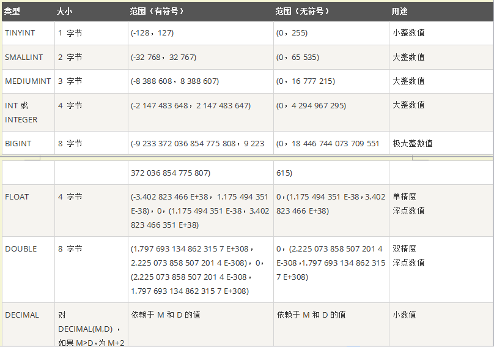

##### 日期和时间

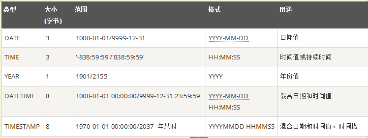

##### 字符串和二进制

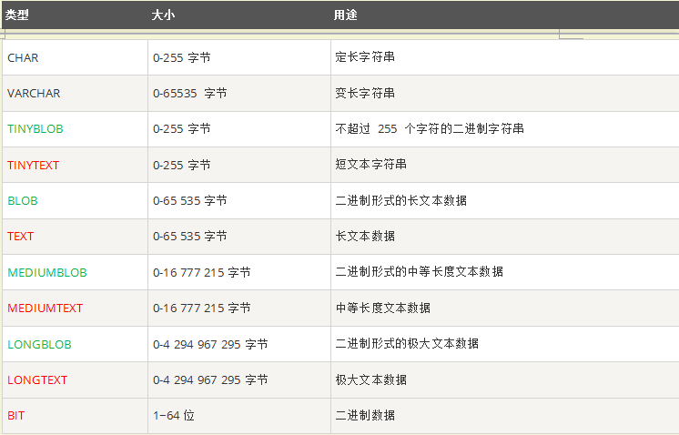

### 数据库表的基本操作

#### 创建数据库表

```
CREATE TABLE table_name
(
    field1  datatype,
    field2  datatype,
    field3  datatype,
)
```

#### 查看数据表

查看当前数据库中的所有表。

```
show tables;
```

查看表结构

```
desc table_name;
```

查看建表语句

```
show create table table_name;
```

####删除数据表

```
DROP TABLE table_name;
```

### 表的约束

为了防止数据表中插入错误的数据，在 MySQL 中，定义了一些维护数据库完整性的规则，即表的约束。

| 约束条件    | 说明                             |
| ----------- | -------------------------------- |
| PRIMARY KEY | 主键约束，用于唯一标识对应的记录 |
| FOREIGN KEY | 外键约束                         |
| NOT NULL    | 非空约束                         |
| UNIQUE      | 唯一性约束                       |
| DEFAULT     | 默认值约束，用于设置字段的默认值 |

表的约束条件都是针对表中字段进行限制，从而保证数据表中数据的正确性和唯一性。

### 数据处理

#### 增加数据

```
INSERT INTO table_name VALUES(value1,value2,value3...);
```

#### 修改数据

```
UPDATE table_name     SET col_name1=expr1 , col_name2=expr2  where condition;
```

#### 删除数据

```
delete from** table_name  [WHERE where_definition];
```

#### 查询数据

```
SELECT [DISTINCT] *|{colum1, colum2, colum3...} FROM table_name;
SELECT指定查询哪些列的数据
column指定列名
* 号表示查询所有列
FROM 指定查询哪种表
DISTINCT 可选，指查询结果时，是否去除重复数据
```

### SQLYong 的介绍

它是一个基于图形化界面的 mysql 客户端软件，通过此软件，我们可以通过图形化界面的方式去连接数据库，

创建表，增删改查数据。整个操作都是基于图形化界面的，避免我们编写大量的 sql 语句，提升我们的开发效率。
