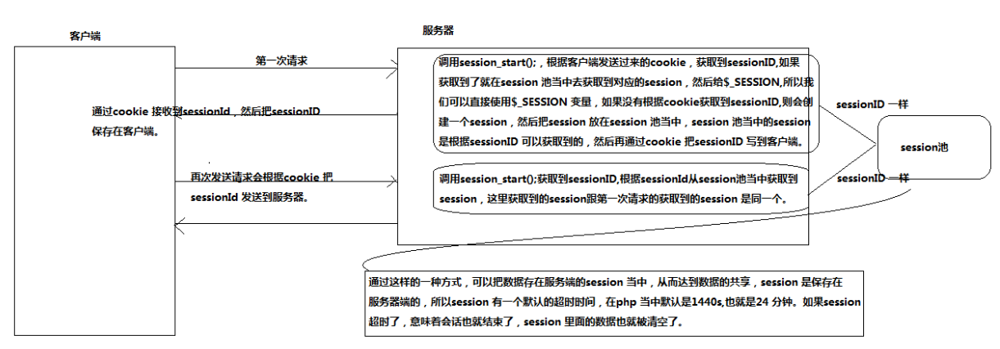
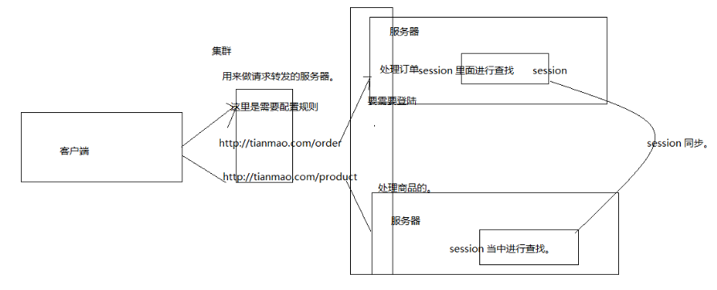
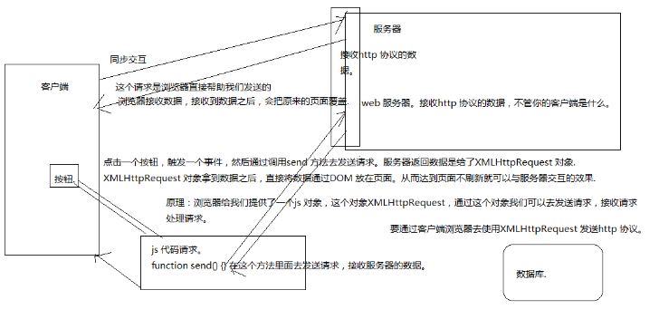

### cookie 的使用

####概念 

```
什么是Cookies（“小甜饼”）呢？简单来说，Cookies就是服务器暂时存放在你的电脑里的资料（.txt格式的文本文件），好让服务器用来辨认你的计算机。当你在浏览网站的时候，Web服务器会先送一小小资料放在你的计算机上，Cookies 会把你在网站上所打的文字或是一些选择都记录下来。当下次你再访问同一个网站，Web服务器会先看看有没有它上次留下的Cookies资料，有的话，就会依据Cookie里的内容来判断使用者，送出特定的网页内容给你。
```

#### cookie 的基本使用

```
服务端：怎么发送cookie (setcookie() 函数用于设置 cookie );
setcookie("user", "Alex Porter", time()+3600); 服务端向客户端设置cookie
客户端：怎么获取cookie
 var cookies=document.cookie;
```

####cookie 的生命周期

##### 内存cookie

```
setcookie("user", "zhuwu");  如果不设置时间，默认就是内存cookie ，当浏览器关闭，客户端会把cookie 清空，整个周期在浏览器的内存当中。
```

##### 硬盘cookie

```
header("Content-Type:text/html;charset=utf-8");
//设置当前cookie 的时间为一天。
setcookie("user", "zhuwu",time()+3600*24);
echo "php cookie";
```

##### 追杀cookie

```
把cookie 的value 设置为空，失效时间改成-1 这样即是追杀cookie，把客户端成cookie 清楚。
setcookie("user", "",-1);
```

####具体作用

```
http 协议是基于请求响应的协议，请求-->响应，连接断开。没有办法记录客户端的状态。也就没有办法对用户的行为进行跟踪，我们可以根据cookie 对用户进行状态的跟踪,。
cookie流程：当第一次访问服务器，服务器可以向客户端发送cookie，可以往cookie 当中存入需要的数据。
客户端如果接收到服务器端响应的cookie，会把cookie 自动保存起来。当客户端再次请求服务器的时候，
浏览器会自动把客户端cookie 的数据发送到服务器。
```

### session (session 的概念，使用，原理，案例)

####概念 

```
session  代表的就是一次会话。会话在我们的现实过程当中有很多，
比如我们拨打10086，在10086，当10086 接通时，代表我的会话开始，中间我可能发送多次动作交谈，直至挂断，会话结束。整个会话过程当中，我们可能会发送多次请求。由多次请求组成一次会话。(一个会话由多次请求组成)
web会话 
	那什么代表我们的网站会话嘞，我们可以这么理解，打开网站，访问我的网站时会话开始，在这个网站当中我可能发送多次请求，直至关闭浏览器会话结束。这整个过程当中我们可以理解成一次会话.http 协议是基于请求响应的，无状态的，一次会话当中包含多个请求，每个请求都是相互独立的，会话当中包含多个请求，我们需要在请求之间共享数据，所以这个时候，我们就需要使用到会话。
	一个网站的会话由多次http请求组成，http 请求是无状态的，是基于请求响应的，每个请求又都是相互独立的
一次会话范围内要进行数据的共享，每个请求都是独立，就不能进行数据的共享。
无状态：请求--》响应  连接断开。我要在一个会话范围内进行数据共享，这个时候我们就需要使用session.
```

####php session使用

```
服务器获取一个session   session_start();  会话开始
获取到session 对象    $_SESSION[] 获取到对象，往里面保存数据	
session 的默认存储时间.
```

####原理

+ 服务器收到客户端的请求后，服务端主动设置一个`session`值，同时再服务端创建一个`session`池，并在返回给客户端的相应中添加一个`set-cookie`属性，客户端收到响应后，在本地存储一个`sessionId`，在此后的每次请求中都通过`cookie`的方式将`sessionId`携带到服务端，服务端拿到`sessionId`再到服务端中的`session`池中获取`session`值；





####实际应用

保存用户登录的状态，当我登录的时候，如果登录成功，服务器把user 保存在session 当中。

#### cookie 与session 对比 

cookie    cookie 是存储在客户端，它是服务器想客户端保存数据。记住用户名。

sessionStroage

客户端的存储，基于html5 ，也是本地存储。生命周期。

localstorage

本地存储，它是实例化到本地的硬盘。

session 

存储在服务器的，依赖cookie。

需求：我要进入到一个页面，这个页面如果是用户已经登录了，我就欢迎欢迎，热烈欢迎。

没有登录，跳转到登录页面。

作业：注销登录。


### ajax

``` 
同步交互：客户端给服务器发送请求，服务器给客户端一个响应，响应回来的数据会把客户端的界面给覆盖，我们把这种交互称为同步交互。
```

```
异步交互:客户端给服务器发送一个请求，服务器给客户端一个响应，响应回来的数据不会把原来的页面覆盖掉，这种我们称为异步交互。
```

ajax 的概念：ajax 就是实现页面不刷新，可以直接获取服务器端数据。

ajax 的原理：利用XMLHttpRequest 发送请求，接收请求的数据.



ajax 的应用

```
//利用XMLHttpRequest对象去进行交互.
//交互分为四步
//1:创建对象
var xhr=new XMLHttpRequest();
//2:打开连接
//提交方式，提交的地址
xhr.open("get","login.php?username=zhangsan");
//3:发送数据
xhr.send(null);
//4:接收数据，只能通过异步的方式，就是只能通过回调函数的方式.
//时刻监听这服务器端状态的改变. onreadystatechange 也是xhr 的一个属性.
xhr.onreadystatechange=function(){
         //服务器数据响应成功之后会调用这个函数.

        //因为我跟服务器进行交互，服务器会进行处理
        //在处理的过程当中会不断的给我一些状态.  0,1,2,3，4
        //每个状态代表的是不同的含义
        //状态我通过xhr 去获取到试一下.
        //readyState 属性去获取到
        //如果状态等于 4 代表响应完成
        if(xhr.readyState==4){  //响应完成.
                //console.log("响应完成") 如果响应的是200 才代表响应成功
                //我们要获取到服务器端状态吗.
                if(xhr.status==200){
                    //真正的处理.
                    //响应完成的，响应是成功的.
                    //接收服务器端返回的数据.responseText 用来接收服务器响应的数据的
                    var data=xhr.responseText;
                    document.querySelector("span").innerHTML=data;
                }
        }
}

get 交互与post 交互需要注意的细节:
get 注意：请求的参数在地址栏当中，send 方法不能省略
post 注意需要有一个特殊的请求头 Content-Type: application/x-www-form-urlencoded
请求的参数写在send 里面
```