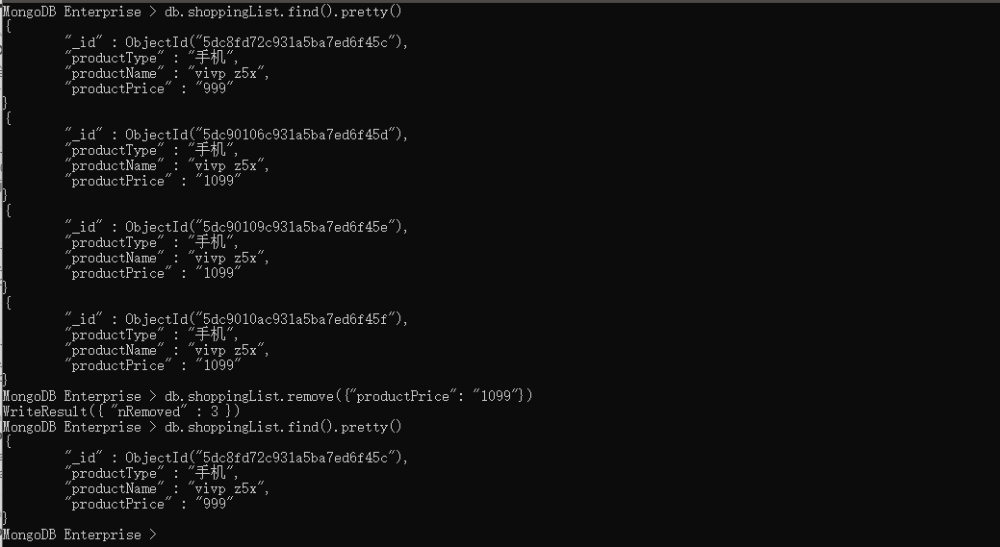

## node 03 Mongo命令行操作数据库

#### 介绍

​		`mongodb`是`node.js`最常使用的数据库，本篇文章旨在记录数据库的操作，至于`mongodb`安装以及配置环境变量自行百度。

#### 操作步骤：

1. 开机，开启（创建）数据库；

   ```bash
   mongod --dbpath D:\data\db
   ```

   设置数据库的文件目录，会在`D:\data\db`下创建相关数据库依赖文件。

2. 连接数据库

   ```bash
   mongo
   ```

   命令行光标左边为`MongoDB Enterprise`时，说明我们已经链接上数据库了，接下来开始操作数据库！

#### 数据库操作

+ **查看数据库列表：**

  ```bash
  show dbs
  ```

  

+ **选择、创建数据库，`use + 数据库名`**

  ```bash
  # 选择数据库
  use admin
  ```

  创建数据库有两个步骤：

  ​	1、use + 新数据库的名称；

  ​	2、在新数据库中添加数据，否则`mongodb`是不会创建这个数据库的；

  ```bash
  # 创建数据库;
  use newStore
  db.students.insert({'name'})
  ```

  

+ **删除数据库**

  ```bash
  db.dropDatabase()
  ```

+ **显示集合**

  ```bash
  show collections
  ```

  

+ **创建集合**

  创建集合有两种方法：

  ```bash
  # 方法1
  # name: 要创建的集合名称
  # options: 可选参数, 指定有关内存大小及索引的选项
  db.createCollection(name, options)
  
  # 方法2 collectionName是要创建集合的名字
  db.collectionName.insert({"name": "zhangsan"});
  ```

  演示结果如下：

  

+ **删除集合**

  ```bash
  # collectionName 为集合的名字
  db.collectionName.drop();
  ```

+ **插入文档**

  `MongoDB` 使用` insert() `或` save() `方法向集合中插入文档，语法如下：

  ```bash
  db.COLLECTION_NAME.insert(document)
  ```

  ***注意：***文档你也可以使用 `db.col.save(document) `命令。如果不指定 _id 字段 `save()` 方法类似于` insert() `方法。如果指定 _id 字段，则会更新该 _id 的数据

+ **更新文档**

  `MongoDB `使用 **`update()`** 和 **`save()`** 方法来更新集合中的文档。接下来让我们详细来看下两个函数的应用及其区别。

  + `update()`方法

    ```bash
    # query : update的查询条件，类似sql update查询内where后面的。
    # update : update的对象和一些更新的操作符（如$,$inc...）等，也可以理解为sql update查询内set后面的
    # upsert : 可选，这个参数的意思是，如果不存在update的记录，是否插入objNew,true为插入，默认是false，不插入。
    # multi : 可选，mongodb 默认是false,只更新找到的第一条记录，如果这个参数为true,就把按条件查出来多条记录全部更新。
    # writeConcern :可选，抛出异常的级别。
    
    db.collection.update(
    	<query>,
        <update>, 
        {
        	upsert: Boolean,
        	multi: Boolean,
        	writeConcern: <document>
    	}
    )
    ```

    **实例：**

    先通过`db.shoppingList.find()`查看当前集合下有什么数据，然后再使用`update()`方法修改产品的价格

  + `save()`方法

    ```bash
    # document: 文档数据
    # writeConcern: 可选，抛出异常的级别
    
    db.collection.save(
       <document>,
       {
         writeConcern: <document>
       }
    )
    ```

+ **删除文档**

  ```bash
  # query: 可选，删除的文档条件
  # justOne: 可选，如果设置为true或1，则只删除1个文档，如果不设置该参数，或使用默认值false，则删除所有匹配条件的文档。
  # writeConcern: 可选，抛出异常的级别
  
  db.collectionName.remove(<query>, {
  	justOne: Boolean,
  	writeConcern: <document>
  })
  ```

  **示例：**

  

  **删除所有文档**

  ```bash
  db.col.remove({})
  ```

+ **查找文档**

  ```bash
  # query: 可选，使用查询操作符指定查询条件
  # projection: 可选，使用投影操作符指定返回的键。查询时返回文档中所有键值， 只需省略该参数即可（默认省略）。
  
  db.collectionName.find()
  ```

  除了 find() 方法之外，还有一个 **`findOne() `**方法，*它只返回一个文档。*

  + **AND条件查找**

    ```bash
    db.col.find({key1:value1, key2:value2}).pretty()
    ```

  + **OR条件查找**

    `MongoDB` OR 条件语句使用了关键字 **$or**,语法格式如下：

    ```bash
    db.col.find({
    	$or: [{key1: value1}, {key2: value2}]
    })
    ```

  + **AND 和 OR 联合使用**

    ```bash
    db.col.find({"likes": {$gt:50}, $or: [{"by": "菜鸟教程"},{"title": "MongoDB 教程"}]}).pretty()
    ```

+ **条件操作符**

  + (>)	大于	`$gt`

    ```bash
    db.col.find({"price": {$gt: 100}})
    ```

  + (<)    小于    `$lt`

    ```bash
    db.col.find({"price": {$lt: 100}})
    ```

  + (>=)    大于等于    `$gte`

    ```bash
    db.col.find({"price": {$gte: 100}})
    ```

  + (<=)    小于等于   `$lte`

    ```bash
    db.col.find({"price": {$lte: 100}})
    ```

  + 使用(<)和(>)查询 大于100小于200的数据

    ```bash
    db.col.find({"price": {$gt: 100, $lt: 200}});
    ```

+ 通过数据类型查找

  `MongoDB` 中可以使用的类型如下表所示：

  |    类型     | 数字 |   备注   |
  | :---------: | :--: | :------: |
  |   Double    |  1   |          |
  |   String    |  2   |          |
  |   Object    |  3   |          |
  |    Array    |  4   |          |
  | Binary data |  5   |          |
  |  Undefined  |  6   | 已废弃。 |
  |  Object id  |  7   |          |
  |   Boolean   |  8   |          |
  |    Date     |  9   |          |
  |    Null     |  10  |          |

  如果想获取 "col" 集合中 title 为 String 的数据，你可以使用以下命令：

  ```bash
  db.col.find({"title": {$type: '2'}})
  # 或者
  db.col.find({"title": {$type: 'string'}})
  ```

+ **分页查询**

  + `.limit(num)`： 查询几条数据
  + `.skip(num)`：略过几条数据

  ```bash
  # 查找第一页 1-10条数据
  db.col.find().limit(10)
  # 查找第二页 11-20条数据
  db.col.find().limit(10).skip(10)
  ```

+ **获取集合信息**

  + 命令：`db.col.stats()`

  + 查询有多少条数据：`db.col.stats().count`

  + `count`表示当前集合有多少条数据，`size`标是当前集合大小.....

    ```js
    MongoDB Enterprise > db.site.stats()
    {
            "ns" : "local.site",
            "size" : 192,
            "count" : 4,
            "avgObjSize" : 48,
            "storageSize" : 20480,
            "capped" : false,
            "wiredTiger" : {
                    "metadata" : {
                            "formatVersion" : 1
                    }
                    // .....
            }
            // ....
    }               
    ```

    

