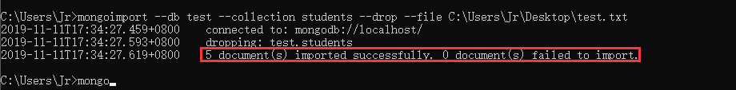

## node 03 数据库操作方法

#### 引入数据

在`mongodb`中我们不可能一条一条往里面插入数据，我们希望可以从其他地方导入数据；

```bash
mongoimport --db test --collection shoppingList --drop --file primer-dataset.json
```

+ --db test：想往哪个数据库里面导入
+ --collection shoppingList：想往那个集合中导入
+ --drop： 把集合清空
+ --file primer-dataset.json：选择哪个文件导入



