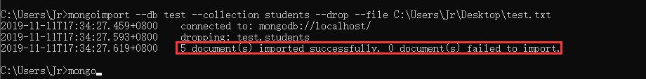

## node 04 Node.js中数据库操作方法

#### 引入数据

在`mongodb`中我们不可能一条一条往里面插入数据，我们希望可以从其他地方导入数据；

```bash
mongoimport --db test --collection shoppingList --drop --file primer-dataset.json
```

+ --db test：想往哪个数据库里面导入
+ --collection shoppingList：想往那个集合中导入
+ --drop： 把集合清空
+ --file primer-dataset.json：选择哪个文件导入



#### Node.js连接数据库

+ 引入模块资源`MongoClient`
+ 配置数据库地址，`var url = 'mongodb://localhost:27017/'`
+ 连接数据库，`MongoClient.conenct(url, callback)`
+ 选择数据库，选择集合，操作数据库。
+ 关闭数据库连接，`db.close()`

```js
var express = require('express');
var MongoClient = require('mongodb').MongoClient;
// 数据库名称
var dbName = 'test'; 
// 链接到指定的数据库
var url = 'mongodb://localhost:27017/' + dbName;
var app = express();

app.get('/', (req, res) => {
    MongoClient.connect(url, (err, db) => {
        if (err) throw err;
        var dbase = db.db();
        dbase.collection('student').insert({}, function(err2, result) {
            if (err2) throw err2;
            db.close();
            res.send('插入数据成功');
        })
    })
})
app.listen('8080', () => {
    console.log('server has started at http://localhost:8080');
})
```

#### 创建数据库

+ 创建数据库

  要在 MongoDB 中创建一个数据库，首先我们需要创建一个 MongoClient 对象，然后配置好指定的 URL 和 端口号。

  **如果数据库不存在，MongoDB 将创建数据库并建立连接**

  ```js
  var MongoClient = require('mongodb').MongoClient;
  var url = "mongodb://localhost:27017/runoob";
   
  MongoClient.connect(url, { useNewUrlParser: true }, function(err, db) {
    if (err) throw err;
    console.log("数据库已创建!");
    db.close();
  });
  ```

+ 创建集合

  ```js
  var MongoClient = require('mongodb').MongoClient;
  var url = 'mongodb://localhost:27017/runoob';
  MongoClient.connect(url, { useNewUrlParser: true }, function (err, db) {
      if (err) throw err;
      console.log('数据库已创建');
      // 这里可以选择 要创建集合的数据库，当前选择为runoob
      var dbase = db.db("runoob");
      dbase.createCollection('site', function (err, res) {
          if (err) throw err;
          console.log("创建集合!");
          db.close();
      });
  });
  ```

  

#### 插入数据库

+ 插入单条数据库：

  ```js
  var MongoClient = require('mongodb').MongoClient;
  var url = "mongodb://localhost:27017/";
   
  MongoClient.connect(url, { useNewUrlParser: true }, function(err, db) {
      if (err) throw err;
      var dbo = db.db("runoob");
      var myobj = { name: "菜鸟教程", url: "www.runoob" };
      dbo.collection("site").insertOne(myobj, function(err, res) {
          if (err) throw err;
          console.log("文档插入成功");
          db.close();
      });
  });
  ```

+ 插入多条数据库，使用`insertMany()`传入数组

  ```js
  var MongoClient = require('mongodb').MongoClient;
  var url = "mongodb://localhost:27017/";
   
  MongoClient.connect(url, { useNewUrlParser: true }, function(err, db) {
      if (err) throw err;
      var dbo = db.db("runoob");
      var myobj =  [
          { name: '菜鸟工具', url: 'https://c.runoob.com', type: 'cn'},
          { name: 'Google', url: 'https://www.google.com', type: 'en'},
          { name: 'Facebook', url: 'https://www.google.com', type: 'en'}
         ];
      dbo.collection("site").insertMany(myobj, function(err, res) {
          if (err) throw err;
          console.log("插入的文档数量为: " + res.insertedCount);
          db.close();
      });
  });
  ```

#### 查询数据库

​		查询数据使用`find()`方法来查找。

```js
var MongoClient = require('mongodb').MongoClient;
var url = "mongodb://localhost:27017/";
 
MongoClient.connect(url, { useNewUrlParser: true }, function(err, db) {
    if (err) throw err;
    var dbo = db.db("runoob");
     var whereStr = {"name":'菜鸟教程'};  // 查询条件
    dbo.collection("site").find(whereStr).toArray(function(err, result) {
        if (err) throw err;
        console.log(result);
        db.close();
    });
});
```

